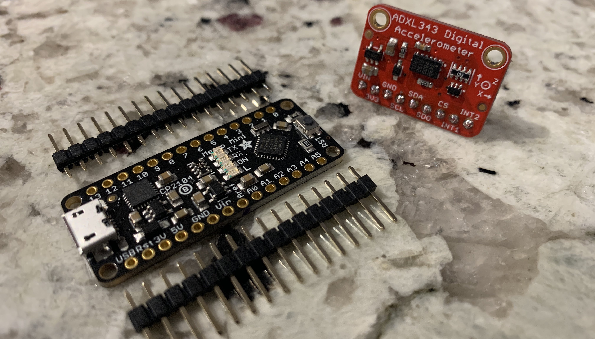
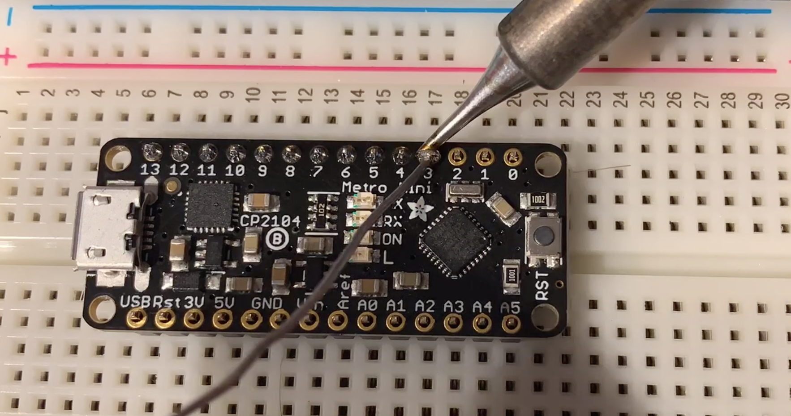
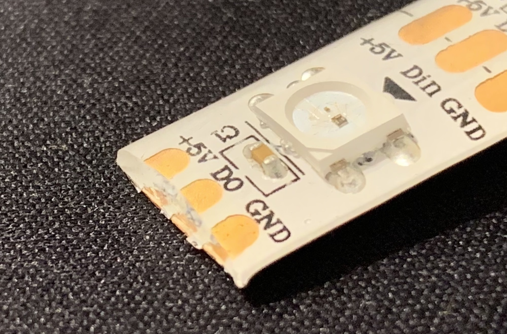
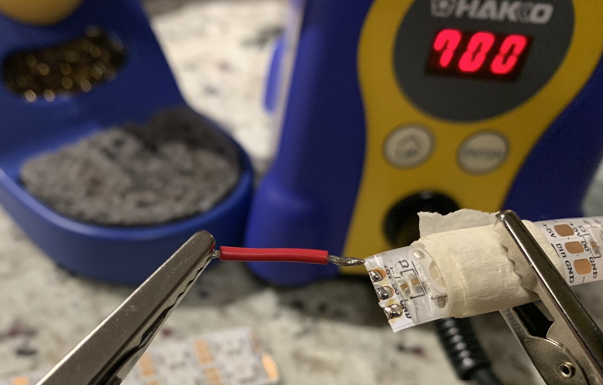
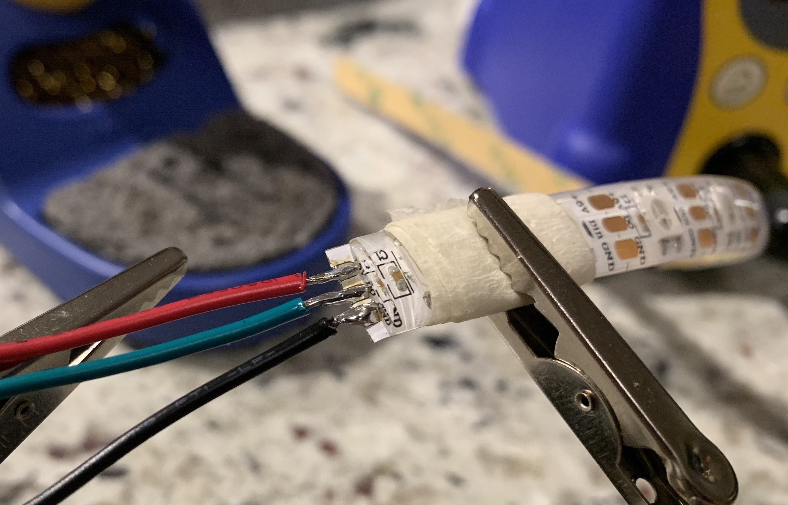
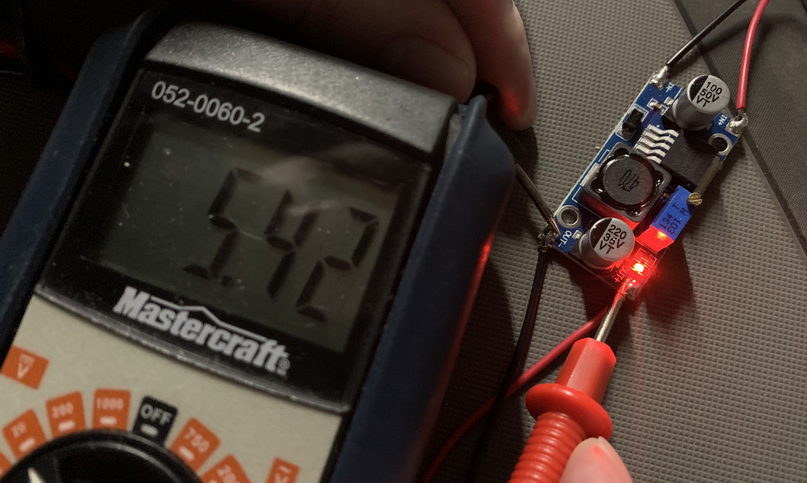

# PanicBrakeLights [Version 1.0]
This repository shows how to add an automatically activated supplementary brake light system to a motorcycle.  The system will activate and strobe to attract attention when greater than average braking force is sensed.

Repository Contents
=========================
* **/img** - Image files for the README file
* **/hardware** - Circuit design information
* **/src** - Project code (*.ino file for Arduino)
* **/LICENSE** - The user license file (open)
* **/README.md** - Project guide (this document)

Requirements and Materials
=========================

**Libraries required:**
* **Adafruit ADXL343 by Adafruit** - [Adafruit ADXL343 Accelerometer Driver](https://github.com/adafruit/Adafruit_ADXL343)
* **Adafruit Unified Sensor by Adafruit** - [Adafruit Unified Sensor Driver](https://github.com/adafruit/Adafruit_Sensor)
* **Adafruit NeoPixel by Adafruit** - [Adafruit NeoPixel Library](https://github.com/adafruit/Adafruit_NeoPixel)

**Materials required:**
* Arduino-based microcontroller: [Adafruit Metro Mini](https://www.adafruit.com/product/2590) is used in my implementation (Adafruit Product ID 2590)
* [Adafruit ADXL343 Triple-Axis Accelerometer](https://www.adafruit.com/product/4097) (Adafruit Product ID 4097)
* Weather-resistant adhesive-backed LED strips: strips of WS2812B individually addressable LED modules such as [Adafruit NeoPixels](https://www.adafruit.com/product/1138) will be used--they are individually addressable and can be cut to any length (as small as one LED element)
* LM2596 DC-to-DC buck converter to step 12V down to 5V (to power system off motorcycle battery)
* Small breadboard to act as substrate and to maintain proper alignment of accelerometer
* Assorted bulk wire, jumper wires, and shrink tube
* Soldering station and soldering supplies including solder, flux, desolding tools/wick, and a "third hand"

Build Instructions
=========================
The main circuit assembly is quite straightforward.  Using a small breadboard as a substrate, connect your Metro Mini, ADXL343, and LED strips (left and right) with the step-down power converter according to the following breadboard diagram and wiring schematic:

You may be required to assemble the accelerometer and microcontroller by attaching the headers.  If so, insert the headers into a breadboard and set the device on the pins.  Then, solder each pin by heating the pin and solder pad on the board at the same time, then touching the solder to the pin and tip of the iron.  The result should look shiny and slightly concave and cover the hole entirely.  If the solder sticks out or forms ball-like structures, it has not properly bonded to the solder pad on the circuit board.  This is called a cold solder joint and it means that the joint is much weaker and will not conduct as well.  Re-heat the solder and hold the tip of the iron firmly to the pad on the board.  After a few seconds, the solder should flow properly and bond with the pad, resulting in a good connection.

  
   

I was fortunate that my motorcycle had a large "blank canvas" in the form of the panniers, so I was able to play with the design of the LED strips and form them into arrows pointing to either side of the motorcycle.  I am aware that many motorcycles will not allow such luxuries, so you will need to adapt the strip design to your needs.  It is possible to cut the strips to any number of pixels in length, but it is important to ensure that any joints are weatherproofed with shrink tubing.  

Following, you can see the process of preparing a strip for connections, tinning the contacts, attaching wire leads, and weatherproofing with shrink tube.

  
   

  
   

I created a custom wiring harness in order to facilitate a cleaner final install.  According to the wiring schematics above, create a wiring harness similar to the following where power is supplied to each +5v pin on the strips and the Vin pin on the Arduino and there is a shared ground between all devices.  I integrated the LED strip data lines into the power supply lines for each strip for a more streamlined package.  Again, ensure all connections are weatherproofed adequately.

Note: the accelerometer should be positioned on the motorcycle such that the X-axis arrow is pointing forward (along the longitudinal axis of the bike).

Once the system is installed on the motorcycle, the last stage is to run power lines from the positive and negative battery terminals to the inputs on the LM2596 power converter.  **Do not plug the power converter output into anything yet!  Calibrate it to output 5V by reading the output pins with a multimeter and turning the screw on the blue potentiometer before plugging in any devices!**

Usage
=========================
Once the hardware is assembled, perform the following preparatory operations to get it up and running:

* Install the Arduino IDE to program the Arduino-based microcontroller
* Install the requisite libraries mentioned above under **Requirements and Materials**
* Install the code listed in /src to the Arduino-based microcontroller
* Set LEDL_COUNT and LEDR_COUNT to the number of left and right LEDs, respectively

Once the above preparatory operations are complete and the step-down power converter output has been calibrated to 5V:

* Double-check all wiring and then supply power to the strips and Arduino.  The device can be tested by shaking it (will impart enough negative acceleration to trigger strobing functionality).

If the initial test is successful, you may alter the threshold of the accelerometer to better suit your needs (supplied threshold is a medium value).  Use the provided thresholding helper functions to save accelerometer data to the built-in EEPROM and then retrieve it via the serial console.  See the following for the general process:

* Enable the StoreAcceleration helper function to record deceleration data to the EEPROM for thresholding.  It is advisable to set the loop delay to something like 250ms so the EEPROM isn't flooded with too many data points and so you can do multiple calibration runs before it runs out of storage.
* Perform several test runs on the motorcycle with varying degrees of braking force.
* Return the Arduino unit to your computer, disable the StoreAcceleration function and enable the PrintEEPROM function to review the accelerometer readings on the serial console.  Note: this resets the EEPROM memory location pointer back to the beginning so you can perform additional calibration runs if necessary.
* Finally, determine which level of negative acceleration is best for your needs and set THRESHOLD to that value.

Credits
=========================
The inspiration for the project came from Instructables.com user *kristeller62* and their [Passive Brake Lights](https://www.instructables.com/id/passive-brake-light/) project.
